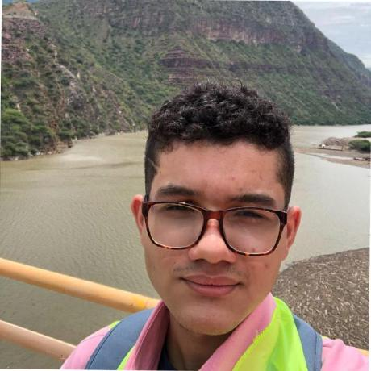

# <h1 align=center> **PROYECTO INDIVIDUAL Nº1** </h1>

# <h1 align=center>**`Machine Learning Operations (MLOps) - Modelo de recomendación (Steam Dataset)`**</h1>

  

    
    <h3> Andres Castaño </h3>
    
Data Scientist Associate | Geological Engineer

    
    

